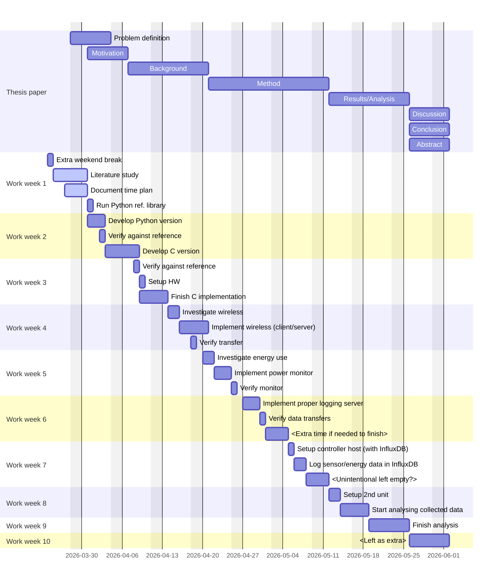

# Proposed time plan

- Week 1: Find and study previous work done, run reference implementation (done in Python, for example) on artificial data.
- Week 2: Setup the first board, start developing C implementation of matrix profile.
- Week 3: Finish implementation and test it on the board.
- Week 4: Investigate and implement sending data wirelessly (preferable) from the board.
- Week 5: Investigate how to measure energy usage, setup extra sensors if required.
- Week 6: Finish both investigations and apply new implementations on the board.
- Week 7: Setup controller and InfluxDB, start collecting sensor data and energy usage.
- Week 8: Setup second board without matrix profile, let it send full sensor data and start analysing the statistics.
- Week 9: Finish the analysis and comparison of both boards, write up the results.
- Week 10: Intentional left as a spare, in case of problems.

# Planned schedule

# Activity log

- 2025-03-26, 8h: Spent about 4h sorting through and starting to read the papers, spent around 3h looking for some easy planning tool with Gantt charts (eh nothing good..) and wrote initial gantt.
- 2025-03-25, 7h: Read up on how to do a literature study and started searching for papers, mostly focused on "time series anomaly detetion using matrix profile". Tomorrow I will have to sort through the 23 papers I've found.

