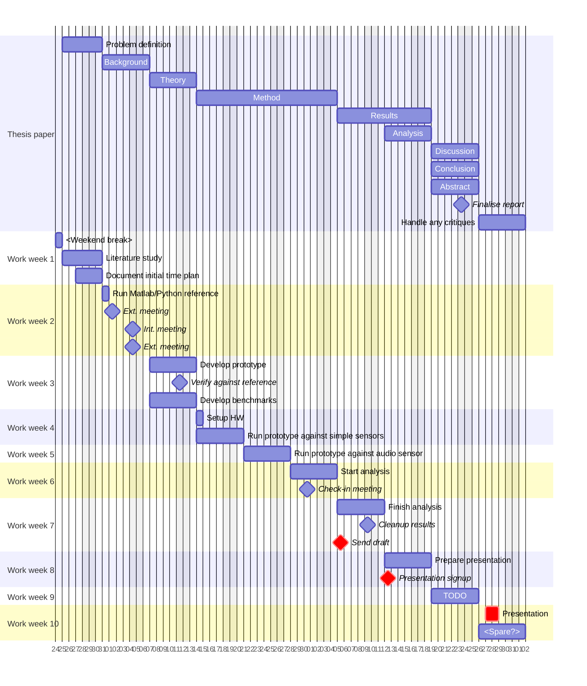

# Original (proposed) time plan

- Week 1: Find and study previous work done, run reference implementation (done in Python, for example) on artificial data.
- Week 2: Setup the first board, start developing C implementation of matrix profile.
- Week 3: Finish implementation and test it on the board.
- Week 4: Investigate and implement sending data wirelessly (preferable) from the board.
- Week 5: Investigate how to measure energy usage, setup extra sensors if required.
- Week 6: Finish both investigations and apply new implementations on the board.
- Week 7: Setup controller and InfluxDB, start collecting sensor data and energy usage.
- Week 8: Setup second board without matrix profile, let it send full sensor data and start analysing the statistics.
- Week 9: Finish the analysis and comparison of both boards, write up the results.
- Week 10: Intentional left as a spare, in case of problems.

# Planned schedule

# Activity log

## Week 4

- 2025-04-14, 5 h:
    Added paper metadata and code listings, added simplified and cleaned up
    pseudo code of the used algorithms to the background section,
    also had to clean up the actual code and ensure it was still running the tests.
    Might have spent about 1 h thinking about how to adapt DAMP to streaming data.

## Week 3

- 2025-04-13, 2 h:
    Continued writing theory.

- 2025-04-12, 4 h:
    Continued with the writing and grabbed a nice image as an example.

- 2025-04-11, 3 h:
    Continued writing the theory and giving examples of related work (but it's
    slow work having to refer to previous academic sources).

- 2025-04-10, 6 h:
    2 h running tests against another library (quick benchmark) and doing small
    refactors of the code,
    3 h start writing the theory section, it's outline, and finding references
    for it.
    1 h watching the thesis writing/presentation lectures.

- 2025-04-09, 5 h:
    1 h reflecting on the implementation and taking notes for the report,
    found the original paper for an implementation detail (MASS v2).
    4 h did small cleanups of the code and pushed the latest commits.
    Found another dataset, ran it using matlab (gathering reference data) and
    added it to the tests.

- 2025-04-08, 11 h:
    7 h continuing with the implementation and was able to run first successful
    test against reference data,
    4 h cleaning up the code and wrote some basic tests.

- 2025-04-07, 7 h:
    7 h started implementing the DAMP algorithm of the Matrix Profile family,
    in Go.

## Week 2

- 2025-04-06, 3 h:
    Finished writing the introduction and made more adjustments to the gantt yet
    again.

- 2025-04-04, 6 h:
    5 h cleaning up intro (it's now the background), setting up proper references,
    and updated gantt again.
    About 1 h in meetings with both supervisors.

- 2025-04-03, 7 h:
    2 h looking up and reading two new papers,
    5 h continuing with the introduction.

- 2025-04-02, 6 h:
    1h updating gantt to reflect project changes.
    5 h coordinating meetings and struggling with the paper's introduction,
    looked up papers for "problems with increasing complexity with AI/ML models",
    and planning a better outline for the introduction.
 
- 2025-04-1, 6 h:
    1 h reflecting on the project and the planned work,
    2 h spent in meeting and mailing,
    1 h looking up signal processing modules for golang,
    2 h looking up raspberry pi and addon boards with sensors and DAC
    functionality.
    
- 2025-03-31, 8 h:
    6 h looking up the original DAMP implementation (in matlab) and then
    comparing it with an unofficial python version (their outputs match up to 9
    significant digits).
    2 h looking at the previous STAMP algo, for it's streaming "online" properties,
    and comparing that against DAMP. Hard to find any reference implementations
    for STAMP.

## Week 1

- 2025-03-28, 6 h:
    4 h wrote the problem definition/delimitation and continued with the background,
    1 h looking up "costs required to operate larger sensor networks",
    1 h adjusting paper headings in the gantt chart.

- 2025-03-27, 7 h:
    2 h adjusting gantt chart,
    3 h sorting through last papers and looking up student theses as examples,
    2 h setting up thesis report with outline and grouping the papers.
 
- 2025-03-26, 8 h:
    Spent about 4 h sorting through and starting to read the papers,
    3 h looking for some easy planning tool with Gantt charts (eh nothing good..)
    and wrote initial gantt.
 
- 2025-03-25, 7 h:
    Read up on how to do a literature study and started searching for papers,
    using "time series anomaly detection using matrix profile".
    Tomorrow I have to sort through the 23 papers I've found.

