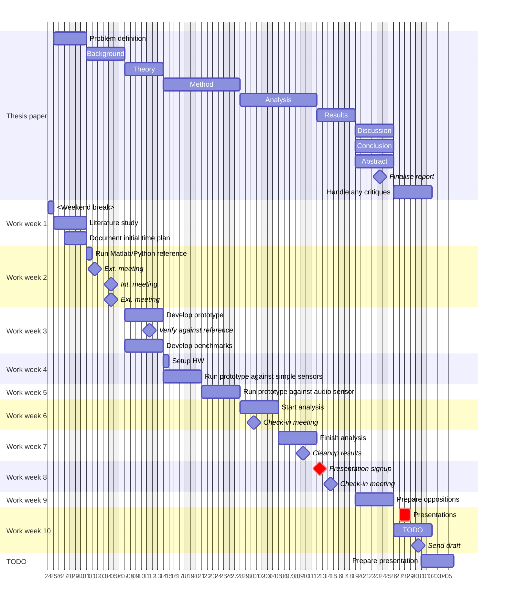

# Activity log

## Week 13

- 2025-08-05, 2.5 h:
    2.5 h finally wrote the abstract, hurrah!

## Week 12

- 2025-07-31, 6 h:
    6 h addressing all feedback from a supervisor, fixing all linter warnings,
    spellchecks, and footnotes/references.

- 2025-07-30, 3 h:
    3 h drawing a wiring diagram and writing acknowledgements.

- 2025-07-29, 6 h:
    6 h writing the discussion, ethics, and conclusion sections, then fixed
    a bunch of old TODOs.

- 2025-07-28, 4 h:
    Start working on the report again, updating code listing showing how to read
    sensors and explanatory text around them, fixed influx plots missing units.

## Week 11

- 2025-06-05, 4 h:
    Start addressing feedback on the report, made a long list.

## Week 10

- 2025-06-01, 6 h:
    6 h continued with the report, sent a first draft.

- 2025-05-31, 5 h:
    5 h added note about subsequence sizes and first half of the analysis,
    tried fiddling some more with the influx graphs.

- 2025-05-30, 6 h:
    About 6 h running the Matlab script on the knutstorp data and twiddling a lot
    more with the influx graphs (there was an unwanted spike in the temperature
    data, caused by an open window...), continued writing.

- 2025-05-29, 0 h:
    Holiday.

- 2025-05-28, 6 h:
    Had a half-hour meeting with supervisor, about 1 h updating sample plots
    and fixing word contractions, 4.5 h writing the results section and doing
    other cleanups.

- 2025-05-27, 6 h:
    About 2 h attending presentations and oppositions of other theses, then about
    4 h continuing with the report and start laying out the results and adjusting
    the plots.

- 2025-05-26, 0 h:
    Busy with other work elsewhere.

## Week 9

- 2025-05-23, 6 h:
    About 1 h cleaning up plots and updating live test on the raspy,
    5 h continuing with the report (reworking the examples takes a lot of time
    to simplify and make them easier to read!) and trying to take a nice photo
    of the hardware setup.

- 2025-05-22, 4 h:
    2 h rewired the raspberry and had it run latest updates, inspecting results
    in influx. 2 h continuing with the report.

- 2025-05-21, 8 h:
    3 h continued working with math examples and then quick meeting with supervisor,
    5 h cleaning up a lot of leftover comments and finishing the background section.

- 2025-05-20, 5 h:
    5 h running a longer benchmark and adding its results to the report, then
    tried to clean up math examples.

- 2025-05-19, 4 h:
    1 h finishing last week's work and pushing it, 3 h investigating issue with
    stream damp (non-normalised) taking way too much time compared to other methods.
    The obvious fix (in hindsight) was to not call math.Pow(), which gave annoyingly
    good results afterwards.
    Had to spend too much time on working as a TA today and lost hours due to that.

## Week 8

- 2025-05-16, 6 h:
    6h continued with the report, started cleaning up examples and sorting through
    the changes from yesterday, booked upcoming presentations.

- 2025-05-15, 8 h:
    8 h continued working on the plots and their scripts, started rewriting parts
    of old sections with new plots and stuff.

- 2025-05-14, 8 h:
    About 2 h meetings with supervisors and checking in progress, 1 h social meeting,
    5 h started reworking plots and created new runtime diagram for comparing the
    different algo versions.

- 2025-05-13, 5 h:
    Had to lookup a typst pkg for drawing figures and finally redrew the last one,
    also updated result plots to highlight differences between normalised yes/no.

- 2025-05-12, 8 h:
    2 h cleaning up sources and added basic benchmark.
    6 h adding scripts and instructions for generating prettier plots for the
    report, only two more images that needs to be replaced.

## Week 7

- 2025-05-09, 0 h:
    "Sick day."

- 2025-05-08, 5 h:
    About 1 h social meeting,
    4 h finished test/timeseries refactor, start using new tool for plotting
    so all plots in the report can be made uniform and allow for better plotting
    widgets.

- 2025-05-07, 7 h:
    About 1 h meeting discussing status of the project and artefacts.
    2 h updating logger and try run it on the raspberry with new algo.
    4 h start rewriting tests to be less fat and slow, adding new helper funcs
    and start refactoring timeseries type.

- 2025-05-06, 7 h:
    1 h mailing people about plots and thesis defence,
    4 h reading up on the math behind convolution, standard deviation, euclidean
    distances and how to do some distance optimisations (while getting sidetracked
    with other interesting optimisations in new papers).
    2 h running some more experiments on the distance function being used for the
    streaming algo and cleaned up code.

- 2025-05-05, 7 h:
    5 h investigated the type of normalisation done in the MASS function,
    wrote an alternative that doesn't z-normalise the input signal and got promising
    results as a reward. The anomaly detection could now handle point anomalies
    (even with extra noise added to the input), thought it through and think this
    is a more wanted application.
    2 h cleaning up all code and doing some refactoring, committing everything.

## Week 6

- 2025-05-02, 6 h:
    2 h investigating and plotting multiple window sizes and how they affect the
    Matrix Profile.
    2 h tried plotting a new dataset from one of the supervisors.
    2 h set up an experiment for adding noise to data samples and experimenting
    with signal filtering before running DAMP on the data.

- 2025-04-30, 9 h:
    2 h meeting with both supervisors and discussing the results and algorithmic
    details, changing the scope and deadline of the project.
    7 h investigating the factors in the MASS function and plotting them, also
    investigating and trying to plot frequency domains of the datasets and see if
    there's any correlation to the matrix profile.

- 2025-04-29, 8 h:
    Continued writing the method and adding lots of new references, plots and
    code examples.

- 2025-04-28, 7 h:
    1 h exploring the gathered data and making a small adjustment to the streaming
    algorithm.
    6 h started working on the method of the thesis and gathering the references
    and hardware details being used.

## Week 5

- 2025-04-25, 3 h:
    3 tried recording audio for amplitude measurement but couldn't get built-in
    driver or ext. DAC device to work, fixed a test and adding initial result plots.

- 2025-04-24, 6 h:
    Discussed the used sensors, cleaned out the gyro as it worked too poorly
    and added temp., pressure, and humidity sensors instead.

-2025-04-23, 9 h:
    Plotted the test data to single png per dataset instead and then a long day
    trying to run DAMP against the sensors, but kept getting NaNs in the discord
    results. Eventually I found it to originate from using a time series with
    constant regions.

- 2025-04-22, 10 h:
    1 h looking up ring buffers, plotting in Go and thinking through the new changes.
    3 h added plotting util and refactored timeseries datatype into a ring buffer.
    6 h creating new streaming alternative to the algo, which was surprisingly
    hard to have it plot a similar graph as the original algo! Had to settle with
    a close-but-not-perfect solution as this was eating up too much time.

- 2025-04-21, 7 h:
    1 h added dhcp server to the raspberry's LAN port so it's easy to access
    during travel to foreign networks.
    1 h troubleshooting why the raspberry didn't accept SSH connections over
    eduroam (it was a mismatch between subnets).
    4 h adding gyro sensor to the logger, although the dep. library is quite buggy.
    1 h fixing dhcp issues at home with the devices, cleaning up code and start
    running the logger live and adjusting influx dashboard for the sensors.

## Week 4

- 2025-04-20, 10 h:
    3 h setting up the raspberry pi and installing influxdb with host monitoring
    using telegraf,
    7 h created first logger prototype that can log current lux value from a
    light sensor.

- 2025-04-17, 3 h:
    1.5 h meeting with getting feedback and picking up equipment.
    1.5 h making corrections in previous sections and was then supposed to start
    working on the equipment (but missing power supply) so took early weekend.

- 2025-04-16, 6 h:
    Finished writing the theory section and started cleaning up lots of warnings
    for passive voice, removed an unused function from the set of mass helpers.

- 2025-04-15, 7 h:
    2 h refining a matlab plot,
    5 h start writing up details of the core algorithm for this work and
    adding yet another plot for it.

- 2025-04-14, 5 h:
    Added paper metadata and code listings, added simplified and cleaned up
    pseudo code of the used algorithms to the background section,
    also had to clean up the actual code and ensure it was still running the tests.
    Might have spent about 1 h thinking about how to adapt DAMP to streaming data.

## Week 3

- 2025-04-13, 2 h:
    Continued writing theory.

- 2025-04-12, 4 h:
    Continued with the writing and grabbed a nice image as an example.

- 2025-04-11, 3 h:
    Continued writing the theory and giving examples of related work (but it's
    slow work having to refer to previous academic sources).

- 2025-04-10, 6 h:
    2 h running tests against another library (quick benchmark) and doing small
    refactors of the code,
    3 h start writing the theory section, its outline, and finding references
    for it.
    1 h watching the thesis writing/presentation lectures.

- 2025-04-09, 5 h:
    1 h reflecting on the implementation and taking notes for the report,
    found the original paper for an implementation detail (MASS v2).
    4 h did small cleanups of the code and pushed the latest commits.
    Found another dataset, ran it using matlab (gathering reference data) and
    added it to the tests.

- 2025-04-08, 11 h:
    7 h continuing with the implementation and was able to run first successful
    test against reference data,
    4 h cleaning up the code and wrote some basic tests.

- 2025-04-07, 7 h:
    7 h started implementing the DAMP algorithm of the Matrix Profile family,
    in Go.

## Week 2

- 2025-04-06, 3 h:
    Finished writing the introduction and made more adjustments to the gantt yet
    again.

- 2025-04-04, 6 h:
    5 h cleaning up intro (it's now the background), setting up proper references,
    and updated gantt again.
    About 1 h in meetings with both supervisors.

- 2025-04-03, 7 h:
    2 h looking up and reading two new papers,
    5 h continuing with the introduction.

- 2025-04-02, 6 h:
    1h updating gantt to reflect project changes.
    5 h coordinating meetings and struggling with the paper's introduction,
    looked up papers for "problems with increasing complexity with AI/ML models",
    and planning a better outline for the introduction.

- 2025-04-1, 6 h:
    1 h reflecting on the project and the planned work,
    2 h spent in meeting and mailing,
    1 h looking up signal processing modules for golang,
    2 h looking up raspberry pi and addon boards with sensors and DAC
    functionality.

- 2025-03-31, 8 h:
    6 h looking up the original DAMP implementation (in matlab) and then
    comparing it with an unofficial python version (their outputs match up to 9
    significant digits).
    2 h looking at the previous STAMP algo, for its streaming "online" properties,
    and comparing that against DAMP. Hard to find any reference implementations
    for STAMP.

## Week 1

- 2025-03-28, 6 h:
    4 h wrote the problem definition/delimitation and continued with the background,
    1 h looking up "costs required to operate larger sensor networks",
    1 h adjusting paper headings in the gantt chart.

- 2025-03-27, 7 h:
    2 h adjusting gantt chart,
    3 h sorting through last papers and looking up student theses as examples,
    2 h setting up thesis report with outline and grouping the papers.

- 2025-03-26, 8 h:
    Spent about 4 h sorting through and starting to read the papers,
    3 h looking for some easy planning tool with Gantt charts (eh nothing good..)
    and wrote initial gantt.

- 2025-03-25, 7 h:
    Read up on how to do a literature study and started searching for papers,
    using "time series anomaly detection using matrix profile".
    Tomorrow I have to sort through the 23 papers I've found.

# Planned schedule

This was the initial schedule, but it was ignored in the last two weeks.

